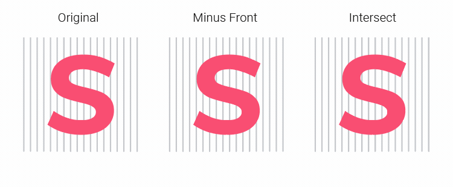

PathSubtract   
============

  

### PathSubtract script is deprecated. Please see new 'SplitPath.jsx' https://github.com/creold/illustrator-scripts

## SplitPath 1.0 (ex-PathSubtract)

 

### Contact
Email <hi@sergosokin.ru>  