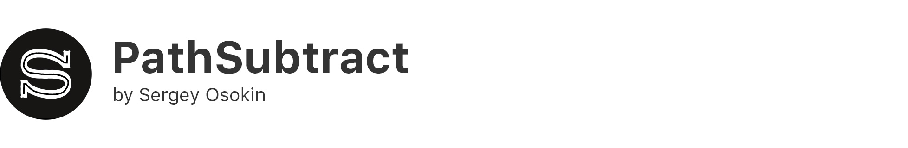
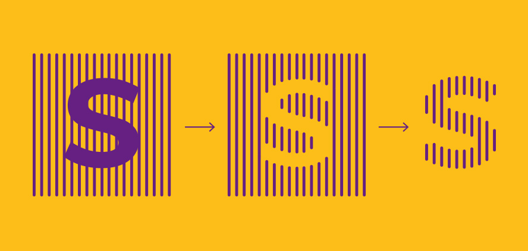
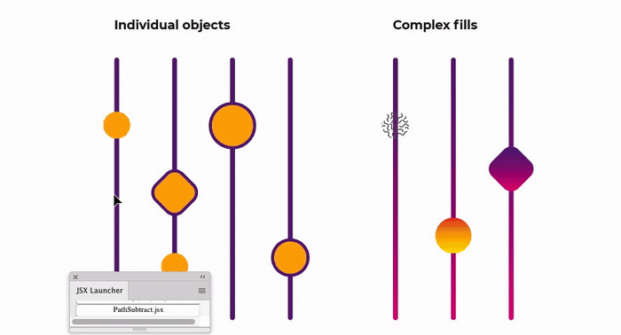
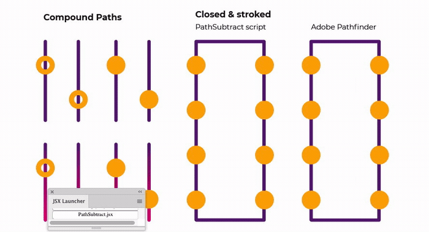
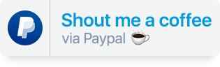

#PathSubtract
  

This script subtracts closed & filled objects from unfilled paths. Pathfinder panel in Adobe Illustrator does not support this function. 

## Installation 

1. [Download archive] and unzip   
2. Place `PathSubtract.jsx` in the Illustrator Scripts folder:
	- OS X: `/Applications/Adobe Illustrator [vers.]/Presets.localized/en_GB/Scripts`
	- Windows (32 bit): `C:\Program Files (x86)\Adobe\Adobe Illustrator [vers.]\Presets\en_GB\Scripts\`
	- Windows (64 bit): `C:\Program Files\Adobe\Adobe Illustrator [vers.] (64 Bit)\Presets\en_GB\Scripts\`
3. Restart Illustrator

[Download archive]: https://github.com/creold/pathsubtract/archive/master.zip 

## Usage 

1. Draw over your lines closed paths for subtraction
2. Select objects
3. Run script `File → Scripts → PathSubtract`
3. Choose to leave paths or cut from your lines

### Demo 01   

Selected objects can be grouped.  
   

### Demo 02   

A script can split a closed path into a series of lines. The Pathfinder panel in this case only subtracts the shape of the upper objects.  

## System Requirements

Should work with Adobe Illustrator CS6 and above.   
The script has been tested on Illustrator CS6 (Win), Illustrator CC 2017/2018 (Mac OS High Sierra).

## Contribute

This script is in development.  
Found a bug? Please [submit a new issues](https://github.com/creold/pathsubtract/issues) on GitHub.

## Donate (optional)
If you find this script helpful, consider shouting me coffee ☕️ via [PayPal] or [Yandex Money] 🙂  

[PayPal]: https://paypal.me/osokin/2usd
[Yandex Money]: https://money.yandex.ru/to/410011149615582
  

### Contact
Email <hi@sergosokin.ru>  

### License

PathSubtract is licensed under the MIT licence.  
See the included LICENSE file for more details.